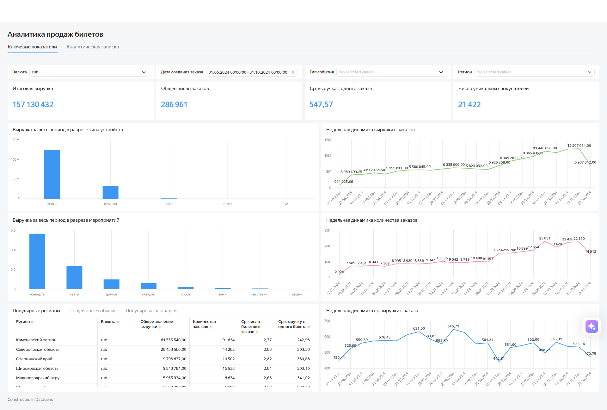

# Аналитика продаж билетов: дашборд в Yandex DataLens

**Цель проекта:** проанализировать эффективность продаж билетов по ключевым метрикам, отслеживать динамику бизнес-показателей, исследовать структуру выручки в разрезе категорий событий и устройств.

## О проекте

Дашборд разработан для мониторинга ключевых показателей эффективности продаж билетов. Решение позволяет:

- отслеживать динамику выручки, количества заказов и среднего чека;
- анализировать популярность мероприятий и площадок;
- исследовать структуру выручки по типам устройств и регионам;
- быстро выявлять пики спроса и проблемные зоны.

## Что реализовано

### Ключевые метрики и индикаторы

На дашборде выведены ключевые показатели эффективности (KPI) за весь период:

- итоговая выручка;
- общее количество заказов;
- средняя выручка с одного заказа;
- число уникальных покупателей.

Эти показатели отображаются в виде значений-индикаторов и пересчитываются при применении фильтров.

### Динамика показателей

Реализованы линейные графики, отображающие недельную динамику показателей:

- выручка с заказов;
- количество заказов;
- средняя выручка с заказа.

Графики позволяют оценить тренды, выявить периоды роста и спада, а также сопоставить динамику выручки и количества заказов.

### Структура выручки

Для анализа структуры выручки построены столбчатые диаграммы:

- выручка в разрезе типов устройств (mobile, desktop, tablet, tv, other);
- выручка в разрезе типов мероприятий (концерты, театры, спорт, выставки и др.).

### Топ-сегменты по выручке

Таблицы с топ-сегментами содержат:

- популярные регионы;
- популярные события;
- популярные площадки.

Для каждого сегмента рассчитаны:

- общее значение выручки;
- количество заказов;
- среднее количество билетов в заказе;
- средняя выручка с одного билета.

### Фильтрация данных

Дашборд поддерживает гибкую фильтрацию:

- по валюте заказа (по умолчанию — RUB);
- по дате (по умолчанию — 01.06.2024–31.10.2024);
- по типу событий (без фильтрации по умолчанию);
- по региону (без фильтрации по умолчанию).

Все фильтры влияют на все визуализации и таблицы на дашборде.

## Технические детали

- **Инструмент:** Yandex DataLens.
- **Источник данных:** данные предоставлены в рамках программы Яндекс Практикума. Исходные файлы с данными не включены в репозиторий.
- **Подход к расчётам:** метрики рассчитаны через QL-чарты.

## Результаты анализа (ключевые инсайты)

На основе данных за период 01.06.2024–31.10.2024 выявлены следующие закономерности:

- **Рост выручки во второй половине периода.** Пик выручки пришёлся на октябрь 2024 года (до 12,2 млн руб. в неделю), после чего наблюдалось снижение.
- **Стабильный рост количества заказов.** Максимум — 23 031 заказ в конце сентября.
- **Колебания среднего чека.** Значения варьировались от 442,81 до 646,71 руб.; пик — в июле–августе, минимум — в начале сентября.
- **Доминирование мобильных устройств.** На mobile приходится около 80% выручки (124,6 млн руб.), на desktop — около 20% (31,9 млн руб.).
- **Концентрация выручки в отдельных сегментах.** Концерты дают 56,5% выручки, театры — 23,6%. Категории «спорт», «выставки», «фильмы» практически не приносят прибыли.
- **Региональная концентрация.** Каменевский регион формирует 39,2% общей выручки, Североярская область — 16,2%, Озернинский край — 6,2%.

## Рекомендации

На основе анализа предложены следующие шаги:

- использовать пиковые периоды (конец августа — октябрь) для проведения рекламных кампаний;
- делать упор на мобильные устройства как основной канал продаж;
- проанализировать причины низких продаж в категориях «спорт», «выставки», «фильмы»;
- разработать маркетинговые стратегии для роста продаж в регионах с низкой выручкой.

## Как использовать дашборд

1. Откройте дашборд по ссылке:  [Аналитика продаж билетов](https://datalens.yandex/x7wy6ajzdaoeh?_share_link=public)
2. При необходимости измените период в фильтре «Дата создания заказа».
3. Для анализа отдельных сегментов используйте фильтры «Тип события» и «Регион».
4. Для сравнения выручки в разных валютах выберите нужную валюту в фильтре «Валюта».

## Скриншоты дашборда

### Основной вид дашборда

> На скриншоте — основная вкладка дашборда с KPI, графиками динамики и таблицами топ-сегментов.
